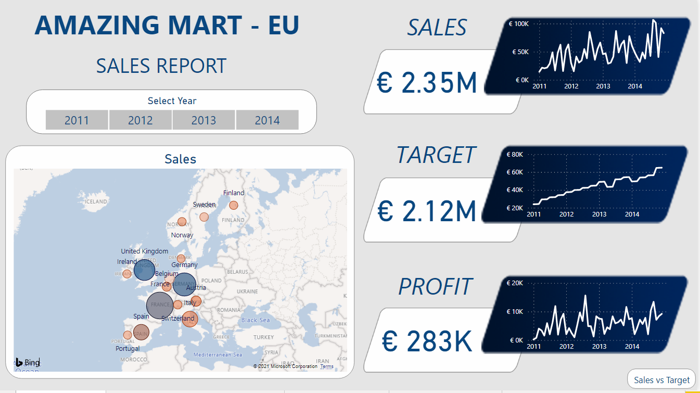
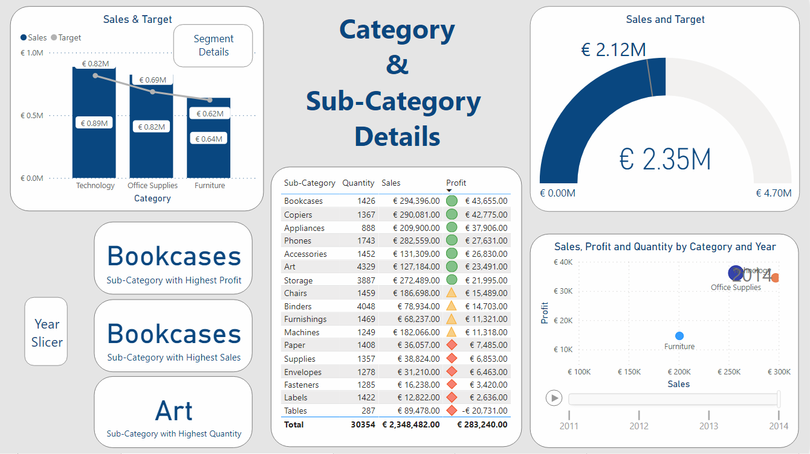
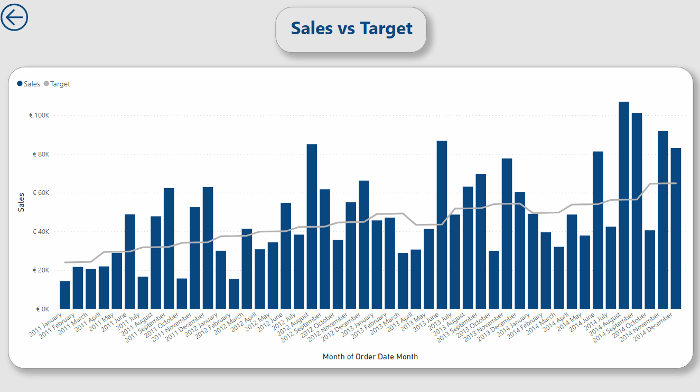

<h1>Data Visualization in Power BI</h1>

Note: Kindly download .pbix files from the above files
**Table of Contents**

1. Amazing Mart Sales Report
2. UK BANK Customer Analysis

<h2>1. Amazing Mart Sales Report</h2>

Amazing Mart is a retail store chain which has customers throughout Europe. The below reports are built based on the data from 2011 to 2014.

The below report contains information regarding:

- Countries of operation and their market size
- Overall Sales, Target and Profit
- Variation is Sales, Target and Profit from 2011 to 2014

The below report contains information regarding:

- Category Sales and Target
- Sub-Category with highest Sales, highest Profit and highest Quantity ordered
- Sub-Category details - Names, Quantity, Sales and Profit
- Category Sales and Profit over the years(2011 -  2014)

<h4> Concepts Used </h4>

- Text Box
- Image
- Slicer
- Map
- Line Chart
- Card with Filters
- Line and Column Chart
- Table with conditional Formatting
- Gauge Chart with Target Value
- Scatter Plot with Play Axis

<h2>2. UK BANK Customer Analysis</h2></

The below report consists of analysis of UK Bank Customers. The report is based on 2015(Jan - Dec) data.

<h4> Concepts Used </h4>

- Shape
- Text Box
- Card
- Pie Chart
- Treemap
- Line Chart
- Scatter Plot
